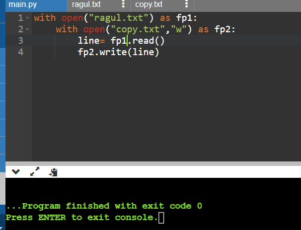
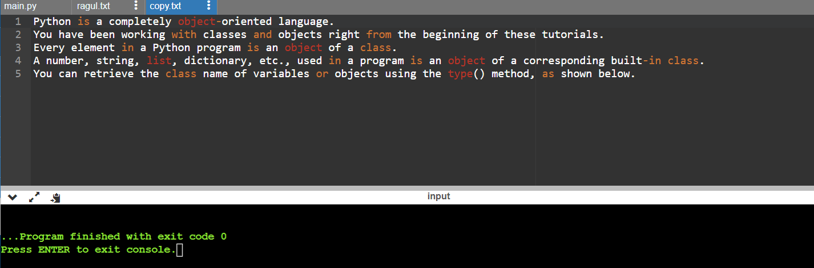

# copy-file
## AIM:
To write a python program for copying the contents from one file to another file.
## EQUIPEMENT'S REQUIRED: 
PC
Anaconda - Python 3.7
## ALGORITHM: 
### Step 1:
create a file with .txt file extension
### Step 2: 
 add some text in that file
### Step 3: 
create a python file
### Step 4:  
write the code to count the number of words in that file
### Step 5: 
run the program
### Step 6: 
display the output
## PROGRAM:
~~~
with open("ragul.txt") as fp1:
    with open("copy.txt","w") as fp2:
        line= fp1.read()
        fp2.write(line)
~~~
### OUTPUT:

## RESULT:
Thus the program is written to copy the contents from one file to another file.